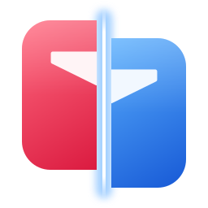
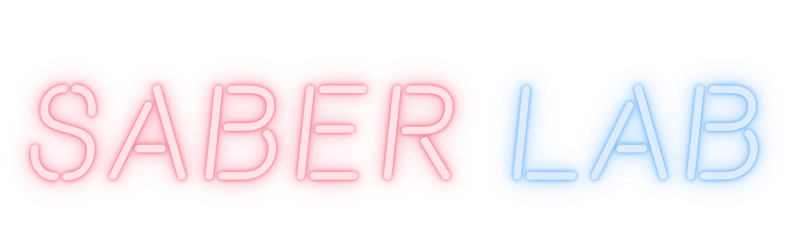
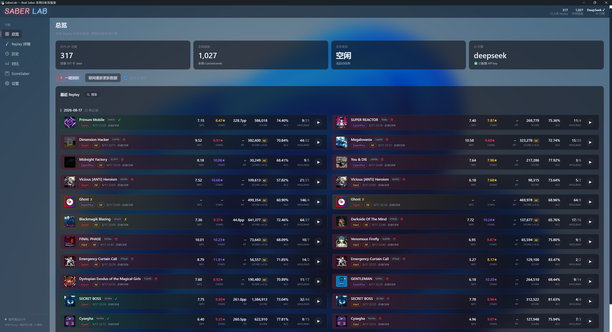
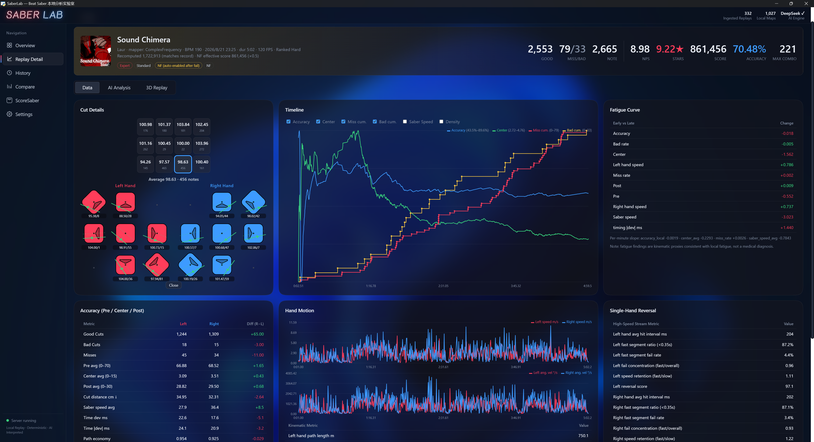
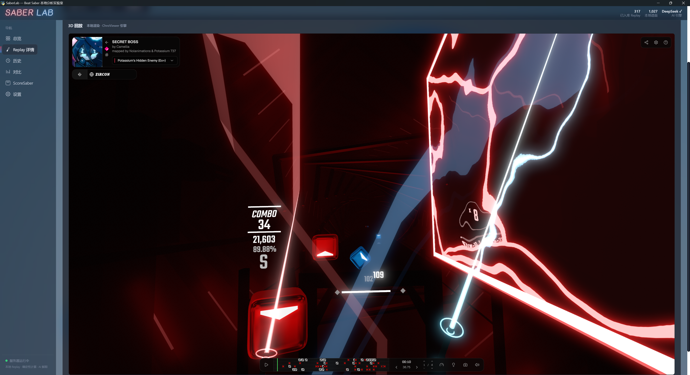

<div align="center">

<p>
<a href="README.zh.md">中文</a> · <a href="README.md">English</a>
</p>

<p>

<br>

</p>

<h1>Why are you losing score?</h1>

<p>
<strong>You only know your score. SaberLab tells you why.</strong>
</p>

<p>
<b>Precisely reconstruct every swing.</b><br>
From accuracy, saber speed, paths, direction changes, and fatigue<br>
to 3D replay, training experiments, and AI coaching,<br>
SaberLab shows you exactly where your score is lost — all processed locally.
</p>

<p>
<a href="https://github.com/Zircon10086/SaberLab">

</a>
<a href="https://github.com/Zircon10086/SaberLab/blob/main/LICENSE">

</a>
<a href="https://github.com/Zircon10086/SaberLab/releases">

</a>
<a href="https://github.com/Zircon10086/SaberLab">

</a>
</p>

<!-- Interface previews (real screenshots) -->

<p>
<a href="docs/screenshots/overview.png">

</a>
</p>

<p>
<a href="docs/screenshots/replay.png">

</a>
<a href="docs/screenshots/chro.png">

</a>
</p>

<p>
<em>SaberLab is under active development. Actual features may differ from the screenshots.</em>
</p>

</div>

---

## Highlights

| Capability | Description |
| --- | --- |
| **Local-first** | Reads local BeatLeader `.bsor` replays and local maps; every metric is computed deterministically in Python, and raw replays are always read-only |
| **Official algorithm** | Faithful port of the official BSOR decoder/scorer — recomputed totals match the recorded score **note for note** (accuracy curve uses the same formula) |
| **Note-anchored analysis** | Timeline curves, fatigue slopes and AI summaries are anchored to real note events — no fixed time windows; mid-song density dips faithfully reflect the map layout |
| **Multilingual** | 简体中文 / English / 日本語 UI switching (language files auto-discovered in Settings) |
| **Standalone window** | Built-in WebView2 window with an acrylic background; relaunch replaces a prior SaberLab instance on 6980, while unrelated port conflicts relocate safely |
| **3D replay** | A ChroViewer port rendering maps/replays/environments fully locally, from local data only |
| **AI coach** | Structured metrics interpreted by an LLM for personalized guidance; can be disabled for rule-based reports (Settings → AI) |
| **Cross-Platform** | Supports ScoreSaber and BeatLeader. star/PP cache rooted at local maps, with 429 rate-limit backoff and retry |
| **Completion status** | Automatically detects mid-play exits / NF (Fail) / duration fallback — clear at a glance in lists and details |
| **Energy & fail time** | The energy bar is recomputed locally with the game's own energy rules, so a run shows when (and whether) it failed, even though replay files never record a fail time |

---

## Download & Install

### GitHub Releases (recommended)

| File | Description | Size |
| --- | --- | --- |
| [SaberLab-v2.2.0-win64.zip](https://github.com/Zircon10086/SaberLab/releases/download/v2.2.0/SaberLab-v2.2.0-win64.zip) | **User edition**: all dependencies bundled (Python runtime + chro 3D viewer). Unzip and double-click to run | ~45 MB |
| [Source (saberlab-src)](https://github.com/Zircon10086/SaberLab) | **Developer edition**: repository source; install dependencies yourself as described under "Build from Source" | — |

> Older versions are available on the [Releases page](https://github.com/Zircon10086/SaberLab/releases).

**First run**:

1. Double-click `SaberLab.exe` — the app window opens.
2. Go to "Settings → Game Path" and click "Choose folder…" to select your Beat Saber root directory — Replay/Map/SongCore paths are derived and validated automatically, and saved on success.
3. Optional: enter an AI API key in "Settings → AI" (it is saved to the `.env` file next to SaberLab); without one you still get algorithm-based basic reports.

---

## Features

### Analysis Engine

- **Accuracy**: Pre(70) / Center(15) / Post(30) per hand, cut distance, timing offset, and official exclusion rules (slider/burst special scoring); a slice-details grid shows how the notes at each position were cut
- **Timeline**: per-note curves placed at each note's real time — accuracy (same formula as the recorded score), center score, saber speed and note density — plus cumulative miss/bad lines, the energy curve and a fail-time marker; hover for exact values
- **Motion**: hand position velocity / angular velocity, path economy, single-hand consecutive direction-change analysis
- **Fatigue**: early vs. late comparison anchored to the first and last note, plus per-minute slopes fitted over fixed-size note groups (kinematic inference, not a medical diagnosis)
- **Energy**: energy curve, fail time, lowest energy, energy lost by cause (miss / bad / bomb / obstacle) and obstacle hits; obstacle drain is still approximate and marked as such in the app
- **Profile**: auto-builds a Saber Profile from each replay's controller offset, A/B experiment records (API-only)

### UI & Replay

- **Overview dashboard**: KPI stats row, recent replays paged by play session / day / count, wide multi-column layout, completion-status gradients; task progress is shown directly on the "Task Status" card
- **Detail page**: three tabs — Data (cut details, timeline with energy summary, fatigue curve, accuracy, hand motion, single-hand reversal, same-map history), AI Analysis and 3D Replay; Esc returns to the list
- **History**: full-library search by song name or map key, paged 300 per page
- **Right-click menu** on any replay: open detail, same-map records, open file location, delete (the file goes to the system recycle bin)
- **3D replay**: embedded iframe in the detail page (ChroViewer port), fully local WebGL rendering, local map source preferred (remote sources disabled by default)
- **Acrylic window**: automatically captures your local wallpaper for a frosted-glass background — beautiful and still readable

### Integration & Sync

- **PP prediction**: click a ranked replay's PP value to open an "Accuracy preview" popover right below it and drag the slider to read the estimated PP at any accuracy (ScoreSaber formula replication, verified within ±0.1%; ScoreSaber data source only)
- **ScoreSaber / BeatLeader**: caches per-difficulty leaderboards rooted at local maps, player PP and a sidebar player card; star numbers can be colored against your own estimated level (80% / 94% / 96% accuracy baselines; a baseline without enough data cannot be selected); network failures never poison the cache
- **AI Coach**: LLM provider abstraction (OpenAI-compatible protocol) fed with structured metrics, single-variable experiments, facts/inference separation; algorithm-generated basic reports even without a key
- **NPS**: supports v2 / v3 note formats, one-click density computation for all maps

---

## System Requirements

- Windows 10 / 11 (x64)
- WebView2 Runtime (bundled with Windows 10/11)
- The packaged build runs out of the box; running from source requires Python 3.12+

## Build from Source

```bat
:: 1. Dependencies (venv without pip: install with an explicit interpreter)
py -3 -m venv --without-pip .venv
py -3 -m pip --python .venv\Scripts\python.exe install fastapi uvicorn numpy pyyaml pywebview

:: 2. Optional 3D replay plugin (external GPL-2.0 project)
:: Build ..\Local-ChroViewer according to its README, then install its
:: SaberLab distribution here (index.html and LICENSE must be present):
robocopy ..\Local-ChroViewer\saberlab\chro plugins\chro /E

:: 3. Run
run.bat                 :: standalone window (acrylic)
run-browser.bat         :: dev mode (system browser)
```

Run tests:

```bat
.venv\Scripts\python.exe -m unittest discover -s tests -v
```

## Documentation

- [Changelog](docs/CHANGELOG.md) (Chinese)
- [Development Guide](docs/DEVELOPMENT.md) (Chinese)

## License

SaberLab itself is released under **[GPL-3.0-or-later](LICENSE)**.

## Acknowledgments

- [ChroViewer](https://github.com/Umbranoxio/chroviewer) (Umbranoxio) — the ChroMapper-derived 3D replay engine
- [BS-Open-Replay](https://github.com/BeatLeader/BS-Open-Replay) (BeatLeader) — source of the official BSOR decoder and scoring logic port
- [ScoreSaber API](https://docs.scoresaber.com/) (ScoreSaber) — official ScoreSaber API documentation
- [SongCore](https://github.com/Goobwabber/SongCore) — reference for the map hash algorithm
- [SliceDetails](https://github.com/qqrz997/SliceDetails) (qqrz997 / ckosmic) — the per-position cut grid is a Python port of its analysis
- [Beon](https://github.com/noirblancrouge/Beon) (Bastien Sozeau / NBR) — the neon wordmark typeface, under the SIL Open Font License 1.1
- The Beat Saber community — for making it all worthwhile

## AI Use Disclosure

This project is developed with the assistance of **[DeepSeek Harness](https://github.com/deepseek-ai/deepseek-harness)**. We maintain full transparency regarding the integration of AI tools in our workflow.

### What AI Did
* **Code Implementation**: Used DeepSeek Harness, Claude Code for boilerplate generation, localized code writing, and routine implementation tasks based on the provided architecture.
* **Localization & Translation**: Assisted in translating documentation and project files to provide multi-language support.

### What Humans Did
* **Architecture & Design**: Project framework, system design, and architectural decisions were made by human.
* **Code Review & Auditing**: Code review is best-effort rather than line-by-line; if you spot an issue, please open an issue.
* **Testing & Debugging**: All debugging, unit testing, and final quality assurance were performed manually to ensure security and stability.


<!-- Placeholder, hidden: ## Contributors -->

<!-- Placeholder: add https://contrib.rocks when there are contributors -->

<!-- Placeholder, hidden: ## Star History -->

<!-- Placeholder: add https://api.star-history.com chart -->
