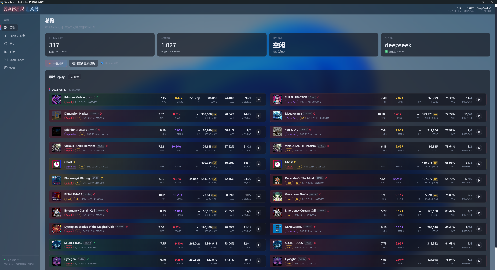
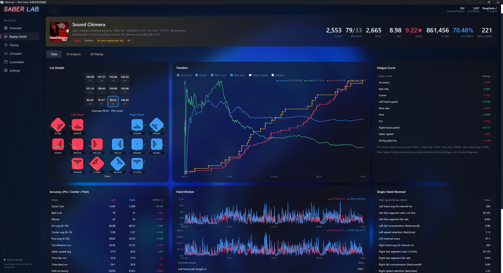
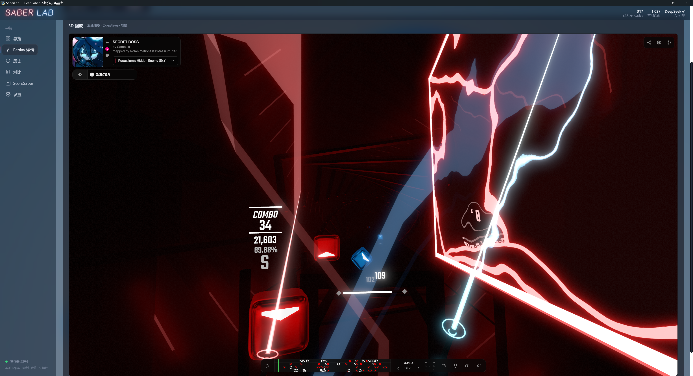

<div align="center">

<p>
<a href="README.zh.md">中文</a> · <a href="README.en.md">English</a>
</p>

<p>

</p>

<h1>为什么你总是在丢分？</h1>

<p>
<strong>你只知道分数，SaberLab 告诉你原因。</strong>
</p>

<p>
<b>精准还原你的每一次挥刀。</b><br>
从精度、刀速、轨迹、换向到疲劳变化，
再到 3D 回放、训练实验与 AI 教练，<br>
SaberLab 帮你找到分数究竟丢在哪里——全部在本地完成。
</p>

<p>
<a href="https://github.com/Zircon10086/SaberLab">

</a>
<a href="https://github.com/Zircon10086/SaberLab/blob/main/LICENSE">

</a>
<a href="https://github.com/Zircon10086/SaberLab/releases">

</a>
<a href="https://github.com/Zircon10086/SaberLab">

</a>
</p>

<!-- 界面预览（真实截图） -->

<p>
<a href="docs/screenshots/overview.png">

</a>
</p>

<p>
<a href="docs/screenshots/replay.png">

</a>
<a href="docs/screenshots/chro.png">

</a>
</p>

<p>
<em>此项目正在快速开发迭代，实际功能可能与图片略有出入。</em>
</p>

</div>

---

## 核心亮点

| 能力 | 说明 |
| --- | --- |
| **本地优先** | 读取本地 BeatLeader `.bsor` Replay + 本地谱面；全部指标 Python 确定性计算，原始 Replay 永远只读 |
| **官方算法** | BSOR 官方解码器/计分器逐项移植，重算总分与 Replay 记录**逐分一致**（acc 曲线同口径） |
| **Note 锚定分析** | 时间序列/疲劳/摘要全部锚定真实 note 事件（固定时间窗口已退役），中段密度低谷忠实呈现谱面结构 |
| **多语言** | 简体中文 / English / 日本語 界面切换（设置页自动发现语言文件），AI 报告语言跟随界面 |
| **独立窗口** | 自带 WebView2 窗口与毛玻璃背景（G2 连续曲率卡片圆角）；端口占用自动顺延 |
| **3D 回放** | ChroViewer 移植，谱面/回放/环境全本地渲染，纯本地数据源 |
| **AI 教练** | 结构化指标交给 LLM 解读，获取个性化指导；可关闭 AI 使用规则报告（设置 → AI） |
| **联网同步** | ScoreSaber 星级/PP 缓存（以本地谱面为根）、429 限速退避重试 |
| **完成度判断** | 中途退出 / NF（Fail）/ 时长 自动判定，列表/详情一目了然 |

---

## 下载安装

### GitHub Releases（推荐）

| 文件 | 说明 | 大小 |
| --- | --- | --- |
| [SaberLab-v1.5.0-win64.zip](https://github.com/Zircon10086/SaberLab/releases/download/v1.5.0/SaberLab-v1.5.0-win64.zip) | **用户版**：内置全部依赖（Python 运行时 + chro 3D 查看器），解压双击即用 | ~45 MB |
| [源码（saberlab-src）](https://github.com/Zircon10086/SaberLab) | **开发者版**：仓库源码，按下方「从源码构建」自行安装依赖 | — |

> 更早版本见 [Releases 页面](https://github.com/Zircon10086/SaberLab/releases)。

**首次使用**：

1. 双击 SaberLab.exe 运行，弹出命令行和自带窗口。
2. 进入「设置 → 游戏路径」，点「选择文件夹…」指定 Beat Saber 游戏根目录——
   自动验证并派生 Replay/谱面/SongCore 相对路径，验证成功即保存。
3. 可选：配置 AI API Key（`.env`），不配置则获取算法的基础报告。


---

## 功能一览

### 分析引擎

- **Accuracy**：Pre(70)/Center(15)/Post(30) 左右手、cut 距离、timing 偏差，
  官方排除规则（slider/burst 特殊计分）
- **Time**：30s 窗口 / 1s 步长（支持调整），独立归一化显示 + 真实范围图例 + 悬停查看具体数值
- **Motion**：手位置速度/角速度、路径经济性、单手连续换向分析
- **Fatigue**：前段 vs 后段 delta + 每分钟斜率（运动学推断，非医学诊断）
- **Profile**：从 Replay 的 controller offset 自动建 Saber Profile，A/B 实验记录（API-only）

### 界面与回放

- **总览仪表盘**：KPI 统计行、按天分页、宽屏多列、完成度状态渐变；任务进度直接呈现在
  「任务状态」卡片
- **详情页**：完成度卡片 + 2×3 指标网格 + 时间序列/疲劳曲线/手部运动图表；
  同谱历史
- **3D 回放**：详情页内嵌 iframe（ChroViewer 移植版），WebGL 全本地渲染，
  本地谱面源优先（远程源默认关闭）
- **毛玻璃窗口**：自动获取本地壁纸并创建毛玻璃背景，保证可读性的前提下做到美观好看。

### 集成与同步

- **ScoreSaber**：以本地谱面为根缓存全难度 leaderboard，
  星级四色分级、玩家 pp、交叉验证；网络失败不投毒缓存
- **AI Coach**：LLM Provider 抽象（OpenAI 兼容协议），引用结构化指标、单变量实验、
  事实/推断分离；无 Key 时也可以获得算法生成的基础报告
- **NPS**：兼容 v2 / v3 方块格式，一键全部计算方块密度

---

## 系统要求

- Windows 10 / 11（x64）
- WebView2 Runtime（Win10/11 自带）
- 打包版解压即用；从源码运行需要 Python 3.12+

## 从源码构建

```bat
:: 1. 依赖（venv 无 pip，装包需显式指定解释器）
py -3 -m venv --without-pip .venv
py -3 -m pip --python .venv\Scripts\python.exe install fastapi uvicorn numpy pyyaml pywebview

:: 2. chro 子项目（3D 回放，改动源码后必须重建）
cd frontend\chro && pnpm build

:: 3. 运行
run.bat                 :: 独立窗口（毛玻璃）
run-browser.bat         :: 开发模式（系统浏览器）
```

运行测试：

```bat
.venv\Scripts\python.exe -m unittest discover -s tests -v
```


## 文档

- [更新日志](docs/CHANGELOG.md)
- [二次开发指南](docs/DEVELOPMENT.md)

## License

SaberLab 本体以 **[GPL-3.0-or-later](LICENSE)**  发布。

`frontend/chro/`（ChroViewer 移植版）是独立的聚合程序，遵循上游 [GPL-2.0](frontend/chro/LICENSE)，改动清单见 [MODIFICATIONS.md](frontend/chro/MODIFICATIONS.md)。

## 致谢

- [ChroViewer](https://github.com/Umbranoxio/chroviewer)（Umbranoxio）—— ChroMapper 衍生的 3D 回放引擎
- [BS-Open-Replay](https://github.com/BeatLeader/BS-Open-Replay)（BeatLeader）—— 官方 BSOR 解码器与计分逻辑移植来源
- [ScoreSaber API](https://docs.scoresaber.com/)（ScoreSaber）—— ScoreSaber 官方 API 文档
- [SongCore](https://github.com/Goobwabber/SongCore) —— 谱面 hash 算法参考


## AI 使用声明

本项目在开发过程中使用了 **[DeepSeek Harness](https://github.com/deepseek-ai/deepseek-harness)** 智能代理进行辅助。

### AI 负责的部分
* **代码编写**：利用 DeepSeek Harness 辅助生成基础样板代码、常规功能实现以及局部代码编写。
* **多语言翻译**：辅助完成项目文档及国际化（i18n）的多语言版本翻译工作。

### 人类开发者负责的部分
* **架构设计**：项目的整体框架、技术选型与系统设计由人类开发者独立完成。
* **代码审查**：AI 生成的所有代码均经过人工审查与重构。
* **测试与 Debug**：所有的漏洞修复（Debugging）、单元测试及最终的质量把关均由人类完成。


<!-- 占位标题，暂时隐藏：## Contributors -->

<!-- 占位：仓库有贡献者后接入 https://contrib.rocks 自动生成 -->

<!-- 占位标题，暂时隐藏：## Star History -->

<!-- 占位：接入 https://api.star-history.com 图表 -->
